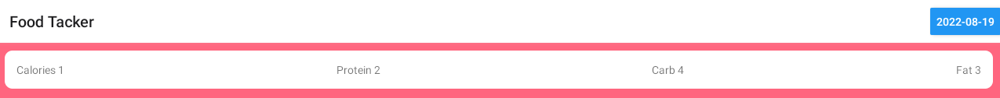

# FoodTracker
FoodTracker is a React Native android app that allows user to keep track of their eating habits.

## Demo

## How to Run
You need to have android studio with a virual device.
Download the repo, open two terminals, one one run `npx react-native start` to start the Metro and on the other run `npx react-native run-android` to download the app on to the virual device.

## Add and Remove Food
User can add the name of the food, calories ands its macronutrient into 'Morning' or 'Afternoon' or 'Evening' depending on the time of day.

After user adds food it will appear under the 'Morning' or 'Afternoon' or 'Evening' depending on what time it was apped along with a remove button to remove food.

## Total Macros and Calories
The user can see the total calories and macros that they have consumed for the day at the top of the screen.

## Calendar 
To see previous days the user taps the 'Date' on the top right to open the 'Calendar' where they can select the date they want to see. The actual date is always highlighted blue.  
Date:  
 
Calendar: 

